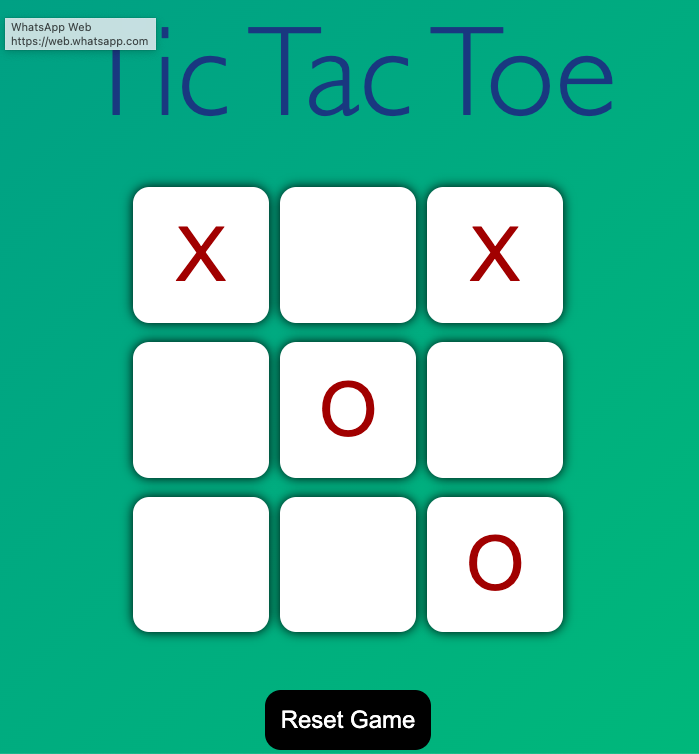

# Tic Tac Toe 🎮

A **responsive and interactive Tic Tac Toe game** built with **HTML, CSS, and JavaScript**. Features smooth animations and **sound effects** for an engaging gameplay experience.

## Features ✨
- Classic **Tic Tac Toe gameplay**  
- **Responsive design** for desktop and mobile  
- **Sound effects** for moves and winning  
- Built with **HTML, CSS, and JavaScript**  

## How to Play 🚀
1. Open `index.html` in your browser.  
2. Click on the grid to make your move.  

## Author 👨‍💻
**Atul Jha**  
- GitHub: [ATULJHAgh](https://github.com/ATULJHAgh)
